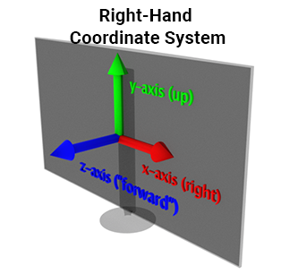

# Reference

- [Khan Academy](https://www.khanacademy.org/computing/pixar/rendering/rendering1/v/rendering-1)
- [Ray Tracing in One Weekend](https://raytracing.github.io/books/RayTracingInOneWeekend.html)
- [레이트레이서를 C 언어로 만들어보는 실습 교재](https://github.com/GaepoMorningEagles/mini_raytracing_in_c)
- [LearnOpenGL - Basic Lighting](https://learnopengl.com/Lighting/Basic-Lighting)

# Coordinate System

  

  <a href="https://www.scratchapixel.com/lessons/mathematics-physics-for-computer-graphics/geometry/coordinate-systems.html">
    <i>Left-Handed vs. Right-Handed Coordinate Systems, Coordinate Systems, Geometry, Scratchapixel 3.0</i>
  </a>

# Phong lighting model

  

  <a href="https://learnopengl.com/Lighting/Basic-Lighting" />
    <i>Basic Lighting, Lighting, LearnOpenGL</i>
  </a>

- **Ambient lighting**: even when it is dark there is usually still some light somewhere in the world (the moon, a distant light) so objects are almost never completely dark. To simulate this we use an ambient lighting constant that always gives the object some color.
- **Diffuse lighting**: simulates the directional impact a light object has on an object. This is the most visually significant component of the lighting model. The more a part of an object faces the light source, the brighter it becomes.
- **Specular lighting**: simulates the bright spot of a light that appears on shiny objects. Specular highlights are more inclined to the color of the light than the color of the object.

# Prefix

- `w` : window
- `n` : normalized
